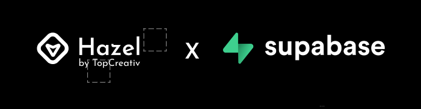

# 🎬 Hazel: Browser Recorder (Development) 🎬




## ✨ Automate Your Browser Like Magic! ✨

Hazel is a powerful Chrome extension that lets you record, save, and replay your browser interactions with cloud synchronization capabilities. Say goodbye to repetitive tasks! 🎉


## 🚀 Awesome Features

### 📹 Recording Superpowers
- **🖱️ Capture Every Move**: Clicks, typing, form submissions, navigation - we've got it all!
- **⏯️ Pause & Resume**: Take a break when needed and pick up right where you left off
- **🔄 Dynamic Variables**: Set up flexible values that change during playback (plain text, AI-generated, or API)
- **📊 Visual Tracking**: Sleek recording toolbar shows status with real-time event counter

### ▶️ Magical Playback
- **🎯 Precision Replay**: Watch Hazel faithfully recreate your recorded actions
- **🧠 Smart Element Finding**: Multiple fallback strategies ensure playback works even when pages change
- **🛡️ Error Recovery**: Hazel tries to keep going even when unexpected changes occur

### ☁️ Cloud Powers
- **🔐 Secure Auth**: Easy and secure cloud authentication
- **🔄 Sync Anywhere**: Access your recordings across devices
- **✈️ Offline Mode**: Works without internet using local storage

## Directory Structure

```bash
.
├── dist                     # Built extension files
│   ├── chrome              # Chrome-specific build
│   └── firefox             # Firefox-specific build
├── public                  # Static assets
│   └── icons              # Extension icons
├── scripts                 # Build/dev scripts
├── src                     # Source code
│   ├── assets             # Global assets (images, styles)
│   ├── background         # Extension background script
│   ├── components         # Shared Vue components. Some prebuilt components are available like `Header`, `Footer`, `LocaleSwitch`, `ThemeSwitch`, `LoadingSpinner`, `ErrorBoundary`, `EmptyState` etc
│   ├── composables        # Vue composables/hooks
│   │   ├── useBrowserStorage  # Browser storage for both `sync` and `local`
│   │   ├── useLocale  # Manage locale in your extension
│   │   ├── useTheme  # Manage theme in your extension
│   ├── content-script     # Content scripts injected into pages
│   ├── devtools          # Chrome devtools panel
│   ├── locales           # i18n translation files
│   ├── offscreen         # Offscreen pages (audio, recording)
│   ├── stores            # Pinia stores
│   ├── types             # TypeScript type definitions
│   ├── ui                # UI pages
│   │   ├── action-popup  # Browser toolbar popup
│   │   ├── common        # Shared pages
│   │   ├── content-script-iframe        # Content script app injected into pages by content script
│   │   ├── devtools-panel # Devtools panel UI
│   │   ├── options-page  # Extension options
│   │   ├── setup        # Install/update pages
│   │   └── side-panel   # Browser side panel
│   └── utils            # Shared utilities
├── manifest.config.ts    # Base manifest configuration
├── vite.chrome.config.ts       # Chrome specific Vite configuration overrides
├── vite.config.ts       # Base Vite configuration
├── vite.firefox.config.ts       # Firefox specific Vite configuration overrides
├── tailwind.config.cjs  # Tailwind CSS configuration
└── package.json         # Project dependencies and scripts
```


### Scripts

- `pnpm dev` - Start development server
- `pnpm build` - Build extension
- `pnpm lint` - Lint files

_You can also use pnpm dev:chrome, pnpm dev:firefox, pnpm build:chrome, pnpm build:firefox, pnpm lint:fix_

_Then load extension in browser with the `dist/` folder_

**Note**: Pack files under `dist/chrome` or `dist/firefox`, you can upload to appropriate extension store.


## Boilerplate
If you are interested in the structure and some other configurations of this codebase,
this codebase is based on [Vite Vue 3 Browser Extension Boilerplate](https://github.com/mubaidr/vite-vue3-browser-extension-v3)